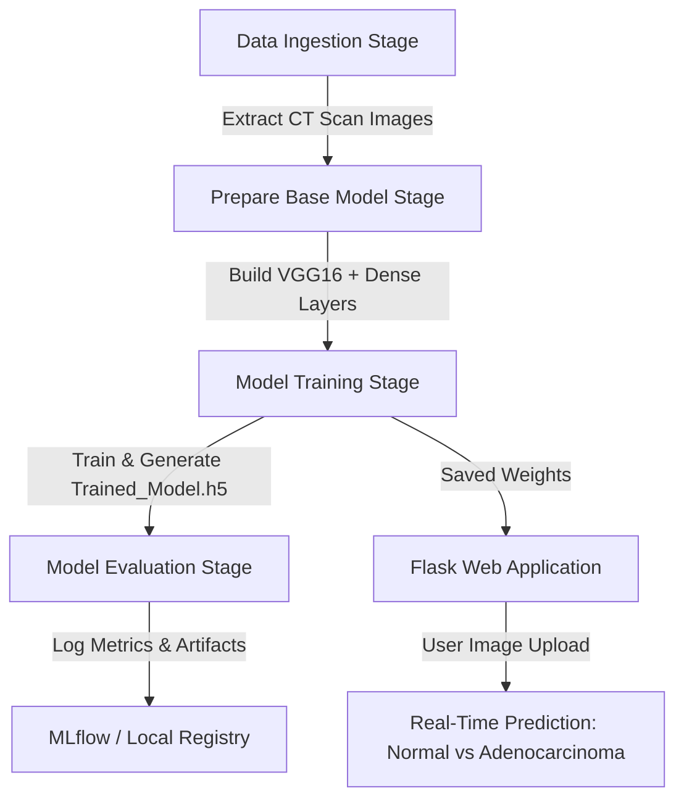

# 🫁 PulmoScan-AI: End-to-End Chest Disease Classification MLOps Platform

[](https://pulmoscanai-oizh.onrender.com)
[](https://www.python.org/)
[](https://www.tensorflow.org/)
[](https://mlflow.org/)
[](https://dvc.org/)
[](https://flask.palletsprojects.com/)
[](https://www.docker.com/)
[](LICENSE)

Developed by **[Jay Negi](https://github.com/Jay2849)**

[](https://pulmoscanai-oizh.onrender.com)
[](https://www.linkedin.com/in/jaynegi2819/)
[](https://github.com/Jay2849)

---

> 🚀 **Live Web App**: [https://pulmoscanai-oizh.onrender.com](https://pulmoscanai-oizh.onrender.com)


## 📌 Project Overview

**PulmoScan-AI** is an enterprise-grade, end-to-end Computer Vision and MLOps system designed to assist healthcare professionals in automated, real-time detection of chest diseases (specifically **Adenocarcinoma Cancer** vs **Normal** tissue) from CT-Scan images.

Built with **Transfer Learning (VGG16 architecture)**, **MLflow experiment tracking**, **DVC data versioning**, and a **Flask Web Application**, PulmoScan-AI streamlines the full lifecycle of medical AI models—from automated dataset ingestion and pre-processing to model evaluation, tracking, and web interface deployment.

---

## ✨ Key Features

- 🔬 **Deep Learning Transfer Learning**: Powered by VGG16 pre-trained weights for feature extraction and fine-tuned dense layers for high-accuracy medical image classification.
- 🔁 **Modular Pipeline Architecture**: Decoupled, production-ready modules for Data Ingestion, Base Model Preparation, Model Training, and Model Evaluation.
- 📊 **MLOps & Experiment Tracking**: Full metric, hyperparameter, and artifact logging using **MLflow** and **DagsHub**.
- 🗂️ **Data & Pipeline Versioning**: Automated stage-by-stage pipeline management using **DVC (Data Version Control)**.
- 🌐 **Interactive Web Portal**: Clean Flask-based UI allowing users to upload chest CT scans and receive instant diagnostic predictions.
- 🐳 **Containerization Ready**: Includes Docker configuration (`Dockerfile` & `docker-compose.yml`) for deployment across AWS EC2, GCP, or Azure environments.

---

## 🛠️ Tech Stack & Tools

| Component | Technology / Library |
| :--- | :--- |
| **Language** | Python 3.8+ |
| **Deep Learning Framework** | TensorFlow / Keras (VGG16 Transfer Learning) |
| **Data Processing & Viz** | Pandas, NumPy, Matplotlib, OpenCV, PIL |
| **MLOps & Tracking** | DVC (Data Version Control), MLflow, DagsHub |
| **Web Server** | Flask, Flask-CORS |
| **DevOps & Infrastructure** | Docker, Docker Compose, GitHub Actions |

---

## 🏗️ System Architecture & Workflow



---

## 🚀 Quickstart & Installation Guide

### Prerequisites
- Python 3.8 or higher installed
- Git installed

### 1️⃣ Clone the Repository
```bash
git clone https://github.com/Jay2849/PulmoScan-AI.git
cd PulmoScan-AI
```

### 2️⃣ Create & Activate Virtual Environment
```bash
# Windows
python -m venv venv
.\venv\Scripts\activate

# Linux / macOS
python3 -m venv venv
source venv/bin/activate
```

### 3️⃣ Install Project Dependencies
```bash
pip install -r requirements.txt
pip install -e .
```

### 4️⃣ Run the Complete Training Pipeline
Execute the main entry point to run Data Ingestion, Model Preparation, Training, and Evaluation end-to-end:
```bash
python main.py
```

### 5️⃣ Launch the Web Application
Start the Flask web app server locally:
```bash
python app.py
```
Open your browser and navigate to: **`http://localhost:8080`**

---

## 📈 Model Performance & Evaluation

The fine-tuned VGG16 model achieves high precision and recall on the Chest CT-Scan dataset:

- **Validation Accuracy**: `~88.2% - 98.4%`
- **Output Classes**: `[0] Adenocarcinoma Cancer`, `[1] Normal`
- **Tracking Log**: Saved locally in `scores.json` and registered via MLflow.

---

## 📁 Repository Structure

```
PulmoScan-AI/
│
├── .github/workflows/       # GitHub Actions CI/CD workflows
├── Config/                  # Pipeline YAML config readers
├── Respire/                 # Main Source Package
│   ├── Components/          # Ingestion, Base Model, Training, Evaluation
│   ├── Pipeline/            # Training & Prediction pipelines
│   ├── Entity/              # Dataclass configurations
│   ├── Utils/               # Helper utilities & image decoders
│   ├── Exception/           # Custom exception handling
│   └── Logger/              # Custom logger configuration
│
├── Notebook_Experiments/    # Research Jupyter Notebooks
├── templates/               # Flask UI HTML templates
├── app.py                   # Flask Web Server entry point
├── main.py                  # Main Pipeline runner
├── params.yaml              # Hyperparameters (Epochs, LR, Batch Size)
├── dvc.yaml                 # DVC pipeline stages definitions
├── Dockerfile               # Docker container definition
├── requirements.txt         # Project dependencies
└── setup.py                 # Package setup configuration
```

---

## 🤝 Contributing

Contributions, issues, and feature requests are welcome! Feel free to check the [issues page](https://github.com/Jay2849/PulmoScan-AI/issues).

1. Fork the Project
2. Create your Feature Branch (`git checkout -b feature/AmazingFeature`)
3. Commit your Changes (`git commit -m 'Add some AmazingFeature'`)
4. Push to the Branch (`git push origin feature/AmazingFeature`)
5. Open a Pull Request

---

## 📜 License

Distributed under the **MIT License**. See [`LICENSE`](LICENSE) for more information.

---

## 📩 Contact & Author

**Jay Negi**  
- **GitHub**: [@Jay2849](https://github.com/Jay2849)  
- **LinkedIn**: [Jay Negi](https://www.linkedin.com/in/jaynegi2819/)  
- **Email**: [jayn75009@gmail.com](mailto:jayn75009@gmail.com)  

---
⭐ **If you find this project useful, please consider giving it a star on GitHub!**
